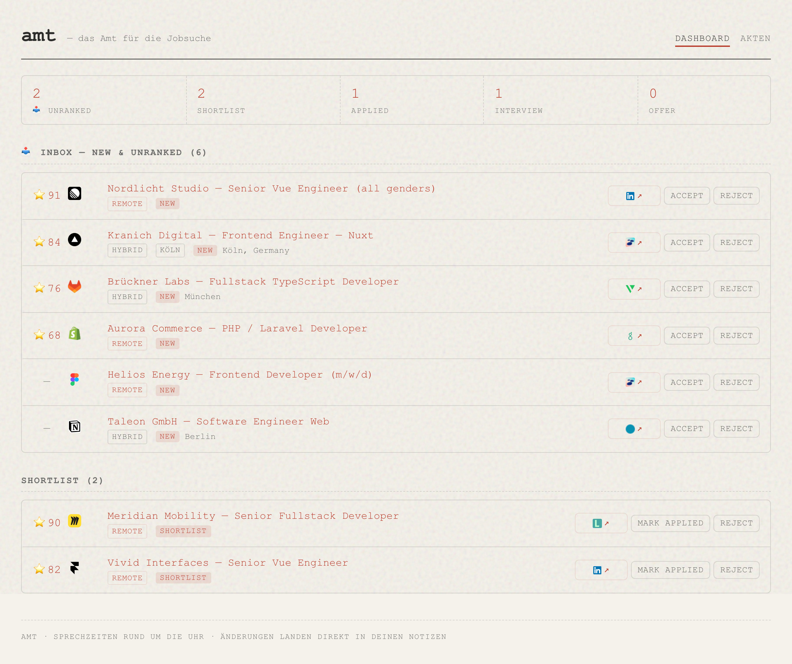

# amt

<p align="center">
  <br>
  <em>Der Sachbearbeiter bei der Arbeit.</em>
</p>

`amt` is a personal job-search toolkit: a CLI plus an MCP server (`amt-mcp`) that puts a
clerk — *der Sachbearbeiter* — inside your AI coding agent. It crawls job APIs
(6 ATS platforms, the Arbeitnow board, and the Bundesagentur für Arbeit), keeps one markdown note per posting that matches your
stack, and files everything else in a seen-ledger so it never resurfaces. You judge,
it stamps, and `prepare` renders CV + cover letter (PDF/txt/md) into an upload-ready folder.

## Setup — let the agent do the paperwork

The easiest way to set up amt is to not set it up yourself. Install the binaries,
wire up your agent, and then just *talk*:

```bash
pnpm add -g @fabkho/amt        # installs the amt + amt-mcp binaries
claude mcp add --scope user amt -- amt-mcp                    # or the plugin, see below
```

Then tell your agent who you are — your stack, salary floor, cities or remote,
what your CV should say (pointing it at an existing CV, PDF or LinkedIn export,
works great as a starting point), how your cover letters should sound. It writes your
`profile.yaml` and `cv-data.<lang>.yaml` into `AMT_HOME` (default `~/.config/amt/`),
which is exactly what the MCP server reads. No forms, no typing YAML by hand.

**Where things land** is yours to choose, via `paths` in `profile.yaml`:
`notesDir` is where the job notes go — any folder works, and an Obsidian vault works
great (the frontmatter shows up as properties, and the self-updating `_index.md` links
every note). `outputBase` is where `prepare` drops the upload-ready application folders.

> *"Set up amt for me: I'm a senior React/Go dev in Hamburg, remote-only, floor 80k.
> Here's my CV: …"*

Prefer doing it by hand? `amt doctor` checks the office is open (and installs Chromium
for PDFs), `amt init` walks you through it interactively.

## Der Dienstweg (the loop)

The full experience is one word to your agent: *"update"* — it crawls every
source **including the agent channels** (LinkedIn & Co.), ranks everything new
against your profile, and files the day's arrivals in `inbox/<date>.md` next
to your notes (the index links every day that still has unranked mail).
The same loop by hand:

```bash
amt sources add shopware   # track a company — its ATS is discovered automatically
amt crawl                  # fetch APIs + tool-crawled channels (LinkedIn, VueJobs)
amt list --status new      # today's stack of files
amt show <slug>            # one posting, full description
amt status <slug> shortlist --score 85   # der Stempel
amt prepare <slug> --lang en             # CV + letter → upload-ready folder
amt status <slug> applied                # case closed. next window, please
```

Statuses: `new → shortlist → applied → interview` (or `rejected` / `cut` — with
`--reason`, because an Amt files even its rejections properly). Also on duty:
`amt import <url>` for pasted ATS links (`--company/--title` for LinkedIn & co.).
The `_index.md` overview in your notes directory keeps itself current.

**It learns from you.** Every cut carries a reason and an optional note, every
score an assessment — all in the markdown, so any future session reads back
*why* you passed on something. `amt suggest` (MCP: `suggest_profile_updates`)
turns that history into proposed `profile.yaml` updates — companies you keep
cutting, your reason mix — for you to confirm. Your blocklists and rules are the
memory that hardens over time: the agent proposes, you approve.

## Die Ausfertigung (CV & cover letters)

amt doesn't just find jobs — it produces the application. `amt prepare <slug>`
builds an upload-ready folder: your **CV rendered from `cv-data.<lang>.yaml`**
(one file per language, de/en) and a **cover letter** drafted the civilized way:
the first run scaffolds `cover-letter.<lang>.md`, you write it with your agent
in chat — carrying your tone rules from `profile.yaml` (the `write-application`
prompt does exactly this) — and the second run renders everything to PDF, html,
and txt. Templates are plain Nunjucks + CSS (`templates/`), PDFs come out of
real Chromium, so what you preview is what HR gets.

## Der Schalter (web dashboard)

Prefer a screen to a terminal? **`amt serve`** opens a local dashboard at
`http://localhost:4400` — triage the day's arrivals like a stack of files.

<p align="center">
  
</p>

- **📥 Inbox** — the day's new postings, ranked; **accept → shortlist** or
  **reject** (with a reason and a free-text note) right from the row. Postings
  below your score threshold are pruned automatically; rows leave the inbox as
  you clear them.
- **Aktenboard** — every note, filterable by status, remote/hybrid, city, minimum
  score, or free text — filters kept in the URL. Defaults to **active** (hides
  rejected/cut). Rows carry the source platform's icon; applied roles show when
  you applied and a button to open their documents folder.
- **One original-posting click** — each row opens the real ad in a new tab.

It's server-rendered (htmx, no build step, no framework), and **every click
writes straight to your markdown notes** — so Obsidian and the dashboard never
disagree. The screenshot is generated from a fictional demo dataset by
`pnpm shoot` ([scripts/shoot.mjs](./scripts/shoot.mjs)); design notes in
[docs/webview-plan.md](./docs/webview-plan.md).

## Die Quellenlage (sources)

amt crawls **official job APIs** directly: boards like Arbeitnow, the
Bundesagentur für Arbeit Jobsuche (Germany's largest job database — queried along
your stack keywords and cities), and the career pages of companies you track — `amt sources add <company>` auto-discovers
which ATS they use (Recruitee, Ashby, Greenhouse, Lever, Personio, SmartRecruiters).

Sites without an API go into `sources.yaml` as a **channel**: a recipe in the
same file. A channel with a `crawl:` block (URL template + a parse spec — CSS
selectors, regex, or JSON paths) is fetched by the tool itself, right alongside
the boards; `amt init` seeds tool-crawled recipes for LinkedIn and VueJobs. A
channel with only a free-form `recipe:` and no `crawl:` block stays
agent-executed — the tool stores it and your agent runs it during a round (good
for detail pages behind a bot wall, like StepStone). Add `render: true` to a
`crawl:` block and amt fetches the page through the bundled Chromium for
JS-rendered sites.

So `amt crawl` genuinely fetches everything with a machine spec — the only step
that still needs the agent is judgment (ranking). Recipes are just data: tweak a
selector or keyword and the very next crawl uses it, no release required.

## Der Sachbearbeiter (agent integration)

**The MCP server is the recommended way to use amt** — the CLI is the paper
form, the agent is the clerk who fills it in. `amt-mcp` exposes the tools
(crawl, import, status, prepare, channels), `job://` resources, and two
workflow prompts (`daily-update`, `write-application`) carrying your profile
and tone rules. The agent drafts with you in chat; the logic stays in code.

**One verb, four levels of formality** — they all reach the same loop:

| You say | Surface | What runs |
| --- | --- | --- |
| "update" | skill trigger phrase | the daily-update workflow |
| `/amt:daily-update` | MCP prompt | crawl_jobs → channels → rank → inbox delta |
| — | `crawl_jobs` tool | fetches APIs + tool-crawled channels, returns the rest to do |
| `amt crawl` | CLI | the deterministic sub-step only (ranking still needs the agent) |

`amt crawl` deliberately isn't called `update`: the bare binary can't run
channels or judge fit, so it fetches what it can and says what's left.

- **Claude Code:** `/plugin marketplace add fabkho/amt` → `/plugin install amt@amt`
  (bundles the MCP server + workflow skills, with auto-updates)
- **Codex CLI:** `codex mcp add amt -- amt-mcp` + copy `skills/` to `~/.agents/skills/`
- **Cursor / Zed:** point a stdio MCP server at `amt-mcp`
- **pi:** copy `pi-extension/` to `~/.pi/agent/extensions/amt/`

## Sprechzeiten (troubleshooting)

- **Node ≥ 22** and pnpm (`corepack enable`; if a global install complains about a
  missing global bin dir, run `pnpm setup` and restart your shell).
- **`amt` behaves strangely / prints nonsense:** macOS ships a deprecated
  `/usr/sbin/amt`. If it shadows the real one, add to the END of your `~/.zshrc`:
  `export PATH="$PNPM_HOME:$PATH"` — `which amt` should point into your pnpm dir.

## Development

`pnpm install && pnpm lint && pnpm build && pnpm typecheck && pnpm test` —
rules and architecture in [CONTRIBUTING.md](./CONTRIBUTING.md).
